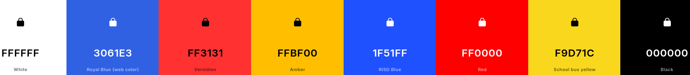
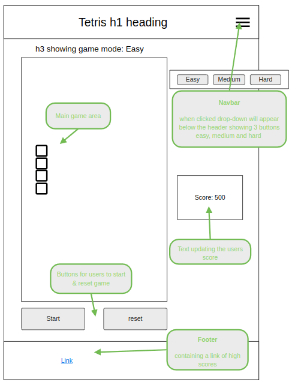
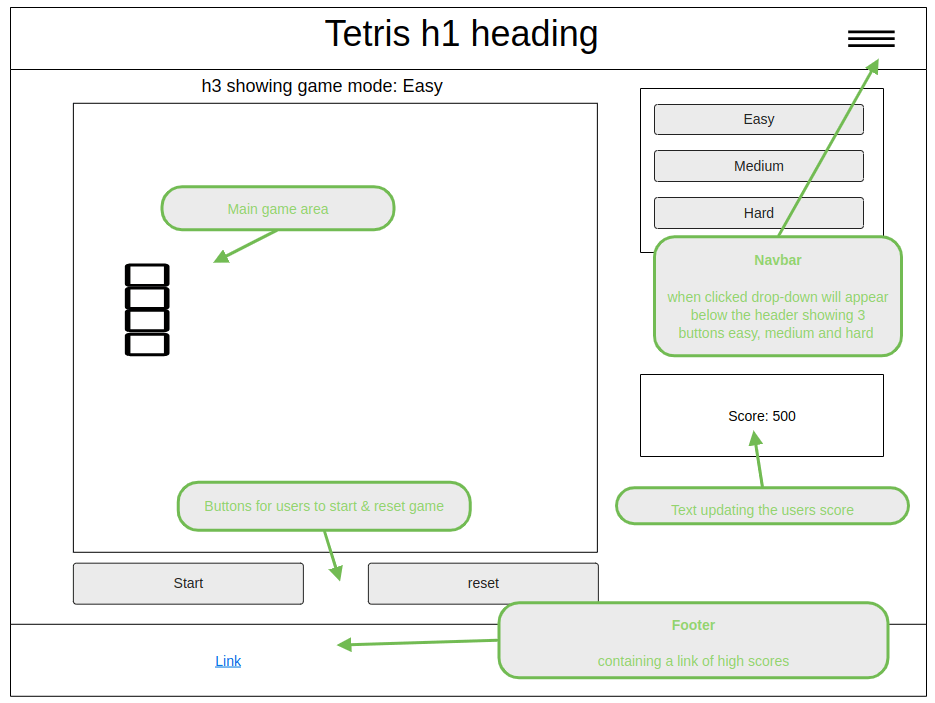

# [SONIC STACK](https://ashlaw96.github.io/Sonic-Stack)

[](https://github.com/AshLaw96/Sonic-Stack/commits/main)
[](https://github.com/AshLaw96/Sonic-Stack/commits/main)
[](https://github.com/AshLaw96/Sonic-Stack)

---

Sonic Stack is a Tetris game with a Sonic design. This is to draw all those Sonic and Tetris lovers all into one awesome box.

When users visit the website they will be able to quickly find the difficulty level they want to start their gaming session and then easily start Tetrissing away. The demographic for the website is anyone that loves old school gaming, anyone that loves Sonic and anyone that enjoys Tetris. It is perfect for all ages and can be played alone our with others.


source: [amiresponsive](https://ui.dev/amiresponsive?url=https://ashlaw96.github.io/Sonic-Stack)

## UX

Sonic Stacks purpose is to help resolve peoples lack of enthusiasm by giving them fun tasks to solve.

The site will have 3 pages, the first page will contain the easy level game area, then the medium game area and finally the hard game area. Each page will comprise with the same layout so the user can easily navigate through the site.

### Colour Scheme

- The design of the Tetris game will incorporate both the slick colours from Sonic and old school styles from Tetris.
  - `#FFFFFF` used for primary text.
  - `#000000` used for main background.
  - `#3061E3` used for blocks.
  - `#1F51FF` used for shadows.
  - `#FF3131` used for blocks.
  - `#FF0000` used for shadows.
  - `#FFBF00` used for blocks.
  - `#F9D71C` used for shadows.

I used [coolors.co](https://coolors.co/ffffff-3061e3-ff3131-ffbf00-1f51ff-ff0000-f9d71c-000000) to generate my colour palette.



I've used CSS `:root` variables to easily update the global colour scheme by changing only one value, instead of everywhere in the CSS file.

```css
:root {
    /* P = Primary | S = Shadow */
    --p-text: #FFFFFF;
    --p-highlight: #000000;
    --p-block1: #3061E3;
    --p-block2: #FF3131;
    --p-block3: #FFBF00;
    --s-block1: #1F51FF;
    --s-block2: #FF0000;
    --s-block3: #F9D71C;
}
```

### Typography

- [Square Mile](https://www.fontget.com/font/square-mile/) was used for all the text.

- [Font Awesome](https://fontawesome.com) icons were used throughout the site, such as the icons in the navigation dropdown.

## User Stories

### New Site Users

- As a new site user, I would like to easily understand the instructions, so that I can play the game as soon as possible.
- As a new site user, I would like to be able to choose different difficulties, so that I can have fun and challenge myself.
- As a new site user, I would like to be able to see my score, so that I know what I need to do better.
- As a new site user, I would like to see what the high score is, so that I can try and beat it.
- As a new site user, I would like to be able to watch others play, so that I can try improve how I play.

### Returning Site Users

- As a returning site user, I would like to pause the game, so that I can come back to where I left off.
- As a returning site user, I would like to play multiplayer, so that I can play with my friends.
- As a returning site user, I would like to have different levels, so that it feels like I'm accomplishing something.
- As a returning site user, I would like to hear old school Tetris/Sonic music, so that it feels like the old games when I'm playing.
- As a returning site user, I would like to see a scoreboard, so that I can see other peoples score and try and beat them.

## Wireframes

To follow best practice, wireframes were developed for mobile, tablet, and desktop sizes.
I've used [Moqups](https://app.moqups.com) to design my site wireframes.

### Mobile Wireframes

<details>
<summary> Click here to see the Mobile Wireframes </summary>

Main
  - 

404
  - 

</details>

### Tablet Wireframes

<details>
<summary> Click here to see the Tablet Wireframes </summary>

Main
  - 

404
  - 

</details>

### Desktop Wireframes

<details>
<summary> Click here to see the Desktop Wireframes </summary>

Main
  - 

404
  - 

</details>

## Features

### Existing Features

#### Header

The header will contain the title and the navigation dropdown button. It will be the same on each page except for the 404 where the title will differ it will also have a background colour that follows the colour scheme.

Main
  - 

404
  - 

#### Navigation

The navigation will be situated at the top of the screen. There will be a tab button within the header section that when pressed will show 3 buttons for the level selectors, so that the user can change the difficulty which will also be highlighted with the current page they are on. On the 404 page there will only be the one button that will help the user return to the previous page.

<details>
<summary> click here to see the navigation of each page </summary>

Easy
  - 

Medium
  - 

Hard
  - 

404
  - 

</details>

#### Aside

This will be situated at the top of the screen on mobile and tablet and then down the side on larger. It will contain 2 dropdown buttons one when clicked by the user will show how to play the game and the other one will contain the current score and the high score.

<details>
<summary> click here to see the aside on each screen </summary>

Mobile
  - 

Tablet
  - 

Desktop
  - 

</details>

#### Main

The main section for the 3 main pages will contain the game area itself and 2 buttons situated below the game area. The first button will be the start button so the user can actually start playing and a reset button if the user wants to start again. There will be a different background image for each main page. For the 404 page the main section will contain an image and a 404 message telling the user that an error has occurred and they need to navigate to the previous page.

<details>
<summary> click here to see the main section of each page </summary>

Easy
  - 

Medium
  - 

Hard
  - 

404
  - 

</details>

#### Footer

The footer will be located at the bottom of the page containing a different link on each of the 3 main pages, of different people playing Tetris games.

Main
  - 

404
  - 

### Future Features

Do you have additional ideas that you'd like to include on your project in the future?
Fantastic! List them here!
It's always great to have plans for future improvements!
Consider adding any helpful links or notes to help remind you in the future, if you revisit the project in a couple years.

## Tools & Technologies Used

- [](https://tim.2bn.dev/markdown-builder) used to generate README and TESTING templates.
- [](https://git-scm.com) used for version control. (`git add`, `git commit`, `git push`)
- [](https://github.com) used for secure online code storage.
- [](https://gitpod.io) used as a cloud-based IDE for development.
- [](https://en.wikipedia.org/wiki/HTML) used for the main site content.
- [](https://en.wikipedia.org/wiki/CSS) used for the main site design and layout.
- [](https://www.javascript.com) used for user interaction on the site.
- [](https://pages.github.com) used for hosting the deployed front-end site.
- [](https://fontawesome.com) used for the icons.
- [](https://moqups.com) used for creating Wireframes.
- [![FontGet](https://img.shields.io/badge/FONTGET-grey?logo=data:image/png;base64,iVBORw0KGgoAAAANSUhEUgAAAOEAAADhCAMAAAAJbSJIAAAAkFBMVEULIjld//8JHTVFvsQIGjVY8fIKHzcZRlgIGzQLITkHGDIFFDAEEi8AACNb+vsIGjMNJz43mKFU5ukADCwXQVIvgo1KzNEAAB0qdYEdUWJN1NgAACcVPVEnbns8pa0fWGdV6OojY3ASNEdBsrkQMEcseoZP2981k50AACEmanYAACo6oKgbTF5IxssyipRCuL6UDAe4AAAK8UlEQVR4nO2daXuqOhCAFYESghQNWkXrXrvZ9v//uyva0ypkmSGJ2vvk/XQWxYQkM5klk1bL4XA4HA6Hw+FwOBwOh8PhcDgcDofD4fhDkNC7pwmbTCZ++bf93/eQ8k//A0hEmZ+t8vno8339USyjVivbrPLdbjfNssxnNPrL3fRi1k3Gg1lnG7SPbFnrdwzp87YzG4yTLou9aze1CWGS5K+9YZq2f0kf6ckn2Ozwb+mw95onSXi1ljbinj1sBsN+u8LHaQdbSefnP/rDweaB3V+ruVjC5G3e21Z7Vw7X3WkfCCnO/nfbm7/9iZGM6WpQBJz+tduzsyEMN4vK/wfFYEXjazUcRkhflmt+9/Yd2JwJlOgu5XxmvXyhtzuQhGajoaB7ez7Z2afjJaeHe4ajjN6mBiH05bHgtvnIdnM+NvGT6JPF48st9jH2RzXZecb8fIWR+F382f7Iv7X1GNG5bPzKyfdW+Ur8Jft4MafRVXrCJ2RTaXP3BPPqoISSJVvylbObETlx9skXGifMksqXwg1PZZ6Sfma3MVXJJFdM0HII8+rWM5zKl21JkU9uQOJEXk/Z0r2mqA5hKxorx31PL7z6aqQbxXI6sM1qSypeAr63H8YV5f3sxSDdJ9EO5oyn2hC2qFAdnhM8da84U6NwBmplJ6s3kkIm94HZ9WZqTDrq9pWMOTLRV+mXkxdEriRTk7uqcSBg3a1/mYRqAfzD4q4+yy8AWwI7uNhxZlm4USuLk0cs2eUXIxtBpH3JM+N8PdoB38+R9JH3EKskA2jjqjbFkXgJEsK/cMSxVbrgDrYHXIVGn6BT4Jt0wFnN9oCPYHs44T6BgZXFD/xXZQXC4B1Ml/x2sTW6h+3BxcQNe4S36kvw4tkHvoftS4mbROBg4ZFuBO5sprKduE9bXkTcxFBFXzLjr8L9a0KK0iOLuwvsbjyC6CBfU7RKhd+kg/suEushDhIC96IHhOLP2zXrYbsT2pY2XZg1cWRIRJ6WGCGszplZVotQq+5AuhSuGvrctIftJ6tqMVphBERHLNwZ3HaqEqwsmosok2dvU/jiB0F8HwKK0J6XcYLaavWEHWyFqybq8OfBIhWkTTzFtGPhiwW7d4exDmtMLWnFMMPM0Wqo6Qx/3kjh/6Oou+6MgNhvq1rRXFkckb295kRTlEUnsCmOJJ96PUynNuQpRQn4jjRPhkkiayBEJosO8RzTgnQnFQYTzNaPSy2UpQ3xUWJGaFN891BHWRwofNP7UzrC/P4il64T4qMcbVxGpufpC0qBKRxjHk5ocem/mO0gRYn3rWLT4c/1e9h+NDqIYYZZOKlqBuGmvABOxE4DXJM6KimQ4F2JHIyuxBeUKcALNZ33sIErsc7Q4EoExmu/qSUl1PC01eEBsYGNBvXOg6nKWURwW3gha2O+xRBl2XNDTZXn6avDkmBlStYgohRlaoHyZz1eVmITBqYGcYKZVI/qxXGP2uJKKAwZ+6I0SS4fAGcfymEnQ+LMQ4ExdQLIbzaIrAnombGEHxBbUrWmaJmwnf7RfzDRQUyIYaHUFCV+r9OAgrdWRHERFBiPQw+W2+v5Dch46Vf1fLkGUPiObWszCT2ccHL9hgb2pl4OX4bG9BOfuB437teyOhs89hXcwaHlw2i82P+rvr5AiHa590kbwuuhAX3RBS/DjuXIXkg4ZvhQ+0dJAt3QKLxP+jBezDFNdFcGLFm5pGc5TyLiirx0rPteKdSu6BtRvhK6fCNVO1OKQeP2doPP5UEw/u/OdEWND9xDFrZPKvkCP0NHHIcFQYBuRFH6mjHoo0AebDk55BigDowvy2kuxBcpLV1XhpfDhnBjWVNIBJ7mvg3ocHi3ljtwRJbZMNc7IA2LV/RBZqEGMgtOM34BMw5t52BHO4k00DQRQftuW6kRP0xkHmnNvbf02d+kr7aVvTSPZ60nAyBOo45lMUPkh48+9H4eYDvVz78ahr5KN/+a9lNX7e7uWc6gJ758W1Vo9lC5aQuEWbKGUFk3W9s9VIea9FAeAbPdQ+uaQqmvdGepah2azYioE+WqWKNuDxWytGP7LFJXmU2nqS0U+jAdW64LdC+w7E9fsmYP5XuamW1NAThprLmnka/z/p1tsxBwUFVzXyq3LT4tO2dACZGatoXUPty+WfY+UYjtpinNZTZ+atuB6K0gYS9NG1/mp5EnOhsAFhTS9NNIfG2pbZvCH0P8fLq+Nom/dG1b2UOsb31/qdjnvbB5wKrkfgzpoLbPWxy3MJTKIoRksHiCdtxCZJ1tjWXNCUiASbvasSdR/NC2TcEN+HLQjx8Syu2hqZw5IdAsHv0YMN9+su598qbAFFT9OD5f7X5YdnKTBJotaEDgcfNpbDtn7kHKvsRAPg03J8q2quhCq2aYyIni5rUN7ZY0jMH1CEzktfGl2vtbHHlogK8lzMBZSkZyE/n5pbPlHZ4c9osJPEvaTIoLP0c4DfAUG4jygir7tqkcYYNp2QVkl0wQFSUMSTxUrr6UDsQ1B7PsD5jK1cedt5ABsgMSePUUY3tH1JkZGZBJFSOKERjLScade5IAcV1N4CWyzJ17MnReEHScDnMo3qAfBXf+UAyvROQ5CGVv9Pwh8gypiHSqnFWYwx0mz5CaOZoMSLJFnag2eg4Yd5ZbRKFy/BHMEWizZ7mR5/EFfKiaFOUIoW3aU4SrqcDnS7FpI+CU67b5mgpGVuJM8dZR20PjdTGQtU24PCu2IGDLfk9hPiyEq0/DReG8pZhfsOHso7obG4UlEG4Qs8RGjaG9oNM0olL5lgZTaCu1cwKJ6Zavkiqw+uVIEuzU+sLWa6sRyEqeEIo4MW4t1QxXc6/GVvbiUcreVs09bN3EKtL0LIwcs1c3sRWial9WWUvGEGPZ26x9iaxfWuFdovDf4OaZ1fqleiUtJP5pjIltO4sHVUf4HPFOEqPsbdcRRtaCPkWypUngPmD7taBbUdiwQFAgjLiHGfiRwSXunEHVZD9BHOqj4Jl/kZrsuLr6Jwjrs0vPbZ1xobr65QUsTXpYEMEKSsCFUUeXuooFc7/FL6L0rFh+6OeEwQXvmmkSyVgLEorBvljLlVMqIO6Z+cczXx2CvXiXvWemySg+ccUgWNlfdgRL4Pc9fTPnajJuOY86V7jvCXFn1zfcoAUwu+sqd3aV966hDA2uXQ7L7gquc+8a4u68Qyt5ojQG1Ya52t158PsPS7g+DFAV9Cvefwi/w7JdJopxbnkUlfM44bp3WJaNhEr7L84YMvV3i8117yHdE0Uw9xTHSwNQ9r3o6nfJlvcBTyH7rnqmiTdVHsGd3sJ9wC3Ync6cPYlK2d/Mnc6t8l7uXCUU01pt2khRTfiW7uVuAe5WD+ZV48mXapobu1u9hPoj2Zgsqj6MeCeZ2Yun6OoitA6h3ZFYdFQzTYikiNh21LVdOawpNBuJ5mo100Ss7ItRdoPj94+QvizX3KZ3KqvqjT/c6Xr5YrPMqwliuhoU9a3c+lzQcKMDQTFY0ZtREBLChM171SHqnc08Xu2ubW/Okhsfvl/u2cPmc3iaZHSehzGpmIX94efmgf2F4TshTJL8tTdMv1flmcKPpr/TOE2Hvdc8+Tujd4oXsy4dD2adbdBe0jAMyaHQMCHxcQcUbDuzwZh2WWz9clGLkIgyP1vl+W63y1ebbP9P2Wa3fv98nOerzGfU9pH3y0BCLwx/x7DlMZbQe89+oMzhcDgcDofD4XA4HA6Hw+FwOBwOh8PhMMl/xR/A9W1KkQUAAAAASUVORK5CYII=&logoColor=00FFFF)](https://www.fontget.com) used for the text font.
- [](https://realfavicongenerator.net) used to create favicon.

## Testing

> [!NOTE]  
> For all testing, please refer to the [TESTING.md](TESTING.md) file.

## Deployment

The site was deployed to GitHub Pages. The steps to deploy are as follows:

- In the [GitHub repository](https://github.com/AshLaw96/Sonic-Stack), navigate to the Settings tab 
- From the source section drop-down menu, select the **Main** Branch, then click "Save".
- The page will be automatically refreshed with a detailed ribbon display to indicate the successful deployment.

The live link can be found [here](https://ashlaw96.github.io/Sonic-Stack)

### Local Deployment

This project can be cloned or forked in order to make a local copy on your own system.

#### Cloning

You can clone the repository by following these steps:

1. Go to the [GitHub repository](https://github.com/AshLaw96/Sonic-Stack) 
2. Locate the Code button above the list of files and click it 
3. Select if you prefer to clone using HTTPS, SSH, or GitHub CLI and click the copy button to copy the URL to your clipboard
4. Open Git Bash or Terminal
5. Change the current working directory to the one where you want the cloned directory
6. In your IDE Terminal, type the following command to clone my repository:
	- `git clone https://github.com/AshLaw96/Sonic-Stack.git`
7. Press Enter to create your local clone.

Alternatively, if using Gitpod, you can click below to create your own workspace using this repository.

[](https://gitpod.io/#https://github.com/AshLaw96/Sonic-Stack)

Please note that in order to directly open the project in Gitpod, you need to have the browser extension installed.
A tutorial on how to do that can be found [here](https://www.gitpod.io/docs/configure/user-settings/browser-extension).

#### Forking

By forking the GitHub Repository, we make a copy of the original repository on our GitHub account to view and/or make changes without affecting the original owner's repository.
You can fork this repository by using the following steps:

1. Log in to GitHub and locate the [GitHub Repository](https://github.com/AshLaw96/Sonic-Stack)
2. At the top of the Repository (not top of page) just above the "Settings" Button on the menu, locate the "Fork" Button.
3. Once clicked, you should now have a copy of the original repository in your own GitHub account!

### Local VS Deployment

No differences were found between the local version and the live deployed version.

## Credits

### Content

| Source | Location | Notes |
| --- | --- | --- |
| [Markdown Builder](https://tim.2bn.dev/markdown-builder) | README and TESTING | tool to help generate the Markdown files |
| [YouTube](https://www.youtube.com/watch?v=AUOzvFzdIk4) | leaderboard | using `localStorage()` in JS for high scores |
| [GitHub Repo](https://github.com/AshLaw96/my-love-maths) | entire site | helped with layout of the site |
| [W3schools](https://www.w3schools.com/jsref/prop_element_classlist.asp) | JS file | helped with adding and removing styles of divs using `.classList` methods |
| [YouTube](https://www.youtube.com/watch?v=rAUn1Lom6dw) | entire site | helped with basics for creating Tetris game |
| [W3Schools](https://www.w3schools.com/jsref/prop_audio_volume.asp#:~:text=Description,) | JS file | `.volume` method to have a mute and un-mute button |
| [W3Schools](https://www.w3schools.com/howto/howto_js_redirect_webpage.asp) | JS file | `location.href` to change pages |
| [Web Dev](https://blog.webdevsimplified.com/2023-04/html-dialog/) | entire site | how to use `<dialog></dialog>` element |
| [Medium](https://medium.com/poka-techblog/simplify-your-javascript-use-some-and-find-f9fb9826ddfd) | JS file | helped using `some()` and `find()` to check arrays |
| [W3Schools](https://www.w3schools.com/jsref/met_audio_pause.asp#:~:text=Description,%2C%20attached%20on%20the%20audio) | JS file | how to use the `play()` and `pause()` methods |
| [W3Schools](https://www.w3schools.com/jsref/jsref_every.asp) | JS file | how to use the `every()` method | 


### Media

Within the Code Institute Slack community, you can find more "free media" links
by sending yourself the following command: `!freemedia`.

| Source | Location | Type | Notes |
| --- | --- | --- | --- |
| [Pinterest](https://www.pinterest.co.uk/pin/8162843068818083/) | website tab bar | image | favicon on the tab bar |
| [Audio Micro](https://www.audiomicro.com/free-sound-effects) | game page | audio | free audio files to generate the game sounds |
| [TinyPNG](https://tinypng.com) | entire site | image | tool for image compression |
| [Pinterest](https://www.pinterest.co.uk/pin/335025659768357500/) | Easy page | image | background image for main section |
| [Khinsider](https://downloads.khinsider.com/game-soundtracks/album/sonic-1-revisited) | index.html | audio | background music on easy page |
| [101SoundBoards](https://www.101soundboards.com/boards/10990-sonic-the-hedgehog-sounds#goog_rewarded) | entire HTML | audio | sound when points gained |
| [TheGamer](https://www.thegamer.com/sonic-the-hedgehog-labyrinth-zone-nightmares/) | medium page | image | background image main section |
| [TheGamer](https://www.thegamer.com/sonic-the-hedgehog-best-final-zones-levels-ranked/) | hard page | image | background image main section |
| [SoahCity](https://soahcity.com/sonic-music/sonic-the-hedgehog-1991-music/#google_vignette) | medium/hard HTML | audio | main background theme songs on medium & hard page |

### Acknowledgements

- I would like to thank my Code Institute mentor, [Tim Nelson](https://github.com/TravelTimN) for his support throughout the development of this project.
- I would like to thank the [Code Institute](https://codeinstitute.net) tutor team for their assistance with the lessons provided to give me the knowledge I needed to make this game.
- I would like to thank the [Code Institute Slack community](https://code-institute-room.slack.com) for the moral support; it kept me going during periods of self doubt and imposter syndrome.
- I would like to thank my partner (Megan), for believing in me, and allowing me to make this transition into software development.
