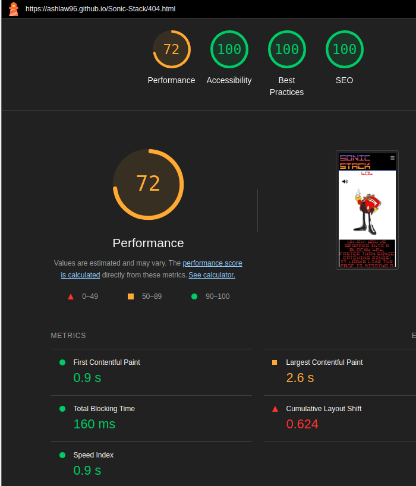

# Testing

> [!NOTE]  
> Return back to the [README.md](README.md) file.

Feature-by-Feature Testing:

- Navigation: I ensured smooth transitions between each section and the links directed to the correct destination.
- Responsive Design: I've checked for compatibility across multiple devices and screen sizes.
- Portfolio Display: I have verified that every page is properly showcased with accurate descriptions, images, and links.
- Game area: I confirmed that the game worked as intended on different devices and screen sizes.
- Buttons: I made sure that all buttons worked as they should and were easy to understand and read.

User Experience Testing:

- Usability Testing: I let users interact with my site and provide feedback of their experience with it.
1.
2.
3.
- Accessibility Testing: I confirmed compliance with accessibility standards e.g. screen reader compatibility, proper alt text for images and keyboard navigation.

Compatibility Testing:

- Browser Compatibility: I Tested on different browsers, to ensure compatible performance.
- Device Compatibility: I ensured functionality across numerous devices.
- Performance Testing:
  - Speed and Load Testing: I used PageSpeed Insights to check page load times and optimized where necessary.

  

  
 Click here to see speed tests of each page 

    - main mobile
    

    - main desktop
    

    - 404 mobile
    

    - 404 desktop
    
    
    

  - Scalability Testing: I assessed how the site handled increased traffic and usage.

Regression Testing:

After implementing any fixes or updates I ensured that previous features and functionalities still worked as intended.

Documentation and Logs:

- whilst creating the blocks, I noticed that where the blocks appeared the box shadow stayed when they left the area.

  - The issue: [issue](documentation/bugs/box-shadow-issue.png)

- To fix this issue I needed to add code into the correct function that removed the box shadow style.

  - The fix: [fix](documentation/bugs/fix-shadow.png)

- Whilst creating the rules hide button, I noticed that it wouldn't show and hide the text as desired.

  - The issue: [issue](documentation/bugs/display-type-issue.png)

- To fix this I had to remove multiple `span` elements inside the button element.
  
  - The fix: [fix](documentation/bugs/display-type-fix.png)

- Whilst creating the blocks, I noticed that the blocks were not in the correct designed shapes.

  - The issue: [issue](documentation/bugs/misshaped.png)

- To fix the issue, I had to change the game areas width and height so each div would fit evenly in the game area.

  - The fix: [fix](documentation/bugs/fix-misshaped.png)

- When creating the game, I noticed that when moving the blocks all way left or right of the game area, it would overlap to the opposite side of the game area.

  - The issue: [issue](documentation/bugs/overlap-right.png)

- To fix this issue, I had to add a function that checked if the block had reached the edge of the game area and if so stop.

  - The fix: [fix](documentation/bugs/fix-overlap-right.png)

- When trying to select all the `div` inside the game area I came across a type error.

  - The issue: [issue](documentation/bugs/type-error.png)

- To fix this issue I used the `querySelectorAll` to get all the child elements inside the game area.

  - The fix: [fix](documentation/bugs/fix-type-error.png)

- Whilst testing the game, I noticed that when turning the blocks near the edge of the game area they would overlap to the other side of the game area.

  - The issue: [issue](documentation/bugs/turn-overlap-screen.png)

- To fix the issue, I had to add a function that implemented code when the block turned near the edge of the game area, move its location away so it didn't overlap the game area.

  - The fix: [fix](documentation/bugs/turn-overlap-fix.png)

- When checking if the alteration of using JavaScript to create the game area had any effect with the 404 page I noticed a type error.

  - The issue: [issue](documentation/bugs/type-error-404.png)

- To fix the issue I had to add an if statement inside the for loop to check if the HTML id name was on the current page and if so execute the desired code but if not do nothing.

  - The fix: [fix](documentation/bugs/type-error-404-fix.png)

User Feedback Incorporation:

## Code Validation

### HTML

I have used the recommended [HTML W3C Validator](https://validator.w3.org) to validate all of my HTML files.

| Directory | File | Screenshot | Notes |
| --- | --- | --- | --- |
|  | index.html |  | no issues were found |
|  | 404.html |  | no issues were found |

### CSS

I have used the recommended [CSS Jigsaw Validator](https://jigsaw.w3.org/css-validator) to validate all of my CSS files.

| Directory | File | Screenshot | Notes |
| --- | --- | --- | --- |
| assets | styles.css |  | no issues were found |

## Browser Compatibility

Sample browser testing documentation:

I've tested my deployed project on multiple browsers to check for compatibility issues.

| Browser | Easy | Medium | Hard | 404 | Notes |
| --- | --- | --- | --- | --- | --- |
| Chrome |  |  |  |  | Works as expected |
| Firefox |  |  |  |  | Works as expected |
| Edge |  |  |  |  | Works as expected |
| Amazon Silk |  |  |  |  | Minor CSS differences |
| Bing |  |  |  |  | Works as expected |

## Responsiveness

Sample responsiveness testing documentation:

I've tested my deployed project on multiple devices to check for responsiveness issues.

| Device | Easy | Medium | Hard | 404 | Notes |
| --- | --- | --- | --- | --- | --- |
| Mobile |  |  |  |  | Works as expected |
| Tablet |  |  |  |  | Works as expected |
| Laptop |  |  |  |  | Works as expected |
| Desktop |  |  |  |  | Works as expected |
| XL screen |  |  |  |  | Noticeable scaling issues |

## Lighthouse Audit

Sample Lighthouse testing documentation:

I've tested my deployed project using the Lighthouse Audit tool to check for any major issues.

| Page | Mobile | Desktop | Notes |
| --- | --- | --- | --- |
| Main |  |  | Some warnings |
| 404 |  |  | Some warnings |

## Defensive Programming

Defensive programming was manually tested with the below user acceptance testing:

| Page | Expectation | Test | Result | Fix | Screenshot |
| --- | --- | --- | --- | --- | --- |
| Easy | | | | | |
| | When the navigation icon is clicked, (3 lines/burger symbol) should show navigation buttons | Tested the feature by clicking on a variety of devices and browsers | The feature behaved as expected and it showed the navigation buttons | Test concluded and passed |  |
| | When each navigation button is clicked on it should change the colour of the current mode that has been clicked on, should change the game difficulty, the title, the background image and the background theme audio | Tested the feature by pressing each button multiple times and multiple devices and browsers | The feature behaved as expected and changed what needed to change | Test concluded and passed |  |
| | When the header title is clicked on should navigate back to the main page | Tested the feature by clicking on the main header title on each section and page on a variety of devices and browsers | The feature behaved as expected and navigated back to the main home page | Test concluded and passed |  |
| | (rule btn) |  |  |  |  |
| | (play/pause) |  |  |  |  |
| | (movement btns) |  |  |  |  |
| | (keys during game) |  |  |  |  |
| | (points added) |  |  |  |  |
| | (show loss) |  |  |  |  |
| | (add high score) |  |  |  |  |
| | (mute/unmute btn) |  |  |  |  |
| | (restart btn) |  |  |  |  |
| | (foot links) |  |  |  |  | 
| Medium | | | | | |
| | When the navigation icon is clicked, (3 lines/burger symbol) should show navigation buttons | Tested the feature by clicking on a variety of devices and browsers | The feature behaved as expected and it showed the navigation buttons | Test concluded and passed |  |
| | When each navigation button is clicked on it should change the colour of the current mode that has been clicked on, should change the game difficulty, the title, the background image and the background theme audio | Tested the feature by pressing each button multiple times and multiple devices and browsers | The feature behaved as expected and changed what needed to change | Test concluded and passed |  |
| | When the header title is clicked on should navigate back to the main page | Tested the feature by clicking on the main header title on each section and page on a variety of devices and browsers | The feature behaved as expected and navigated back to the main home page | Test concluded and passed |  |
| | (rule btn) |  |  |  |  |
| | (play/pause) |  |  |  |  |
| | (movement btns) |  |  |  |  |
| | (keys during game) |  |  |  |  |
| | (points added) |  |  |  |  |
| | (show loss) |  |  |  |  |
| | (add high score) |  |  |  |  |
| | (mute/unmute btn) |  |  |  |  |
| | (restart btn) |  |  |  |  |
| | (foot links) |  |  |  |  | 
| Hard | | | | | |
| | When the navigation icon is clicked, (3 lines/burger symbol) should show navigation buttons | Tested the feature by clicking on a variety of devices and browsers | The feature behaved as expected and it showed the navigation buttons | Test concluded and passed |  |
| | When each navigation button is clicked on it should change the colour of the current mode that has been clicked on, should change the game difficulty, the title, the background image and the background theme audio | Tested the feature by pressing each button multiple times and multiple devices and browsers | The feature behaved as expected and changed what needed to change | Test concluded and passed |  |
| | When the header title is clicked on should navigate back to the main page | Tested the feature by clicking on the main header title on each section and page on a variety of devices and browsers | The feature behaved as expected and navigated back to the main home page | Test concluded and passed |  |
| | (rule btn) |  |  |  |  |
| | (play/pause) |  |  |  |  |
| | (movement btns) |  |  |  |  |
| | (keys during game) |  |  |  |  |
| | (points added) |  |  |  |  |
| | (show loss) |  |  |  |  |
| | (add high score) |  |  |  |  |
| | (mute/unmute btn) |  |  |  |  |
| | (restart btn) |  |  |  |  |
| | (foot links) |  |  |  |  | 
| 404 | | | | | |
| | When the navigation icon is clicked, (3 lines/burger symbol) should show navigation button | Tested the feature by clicking on a variety of devices and browsers | The feature behaved as expected and it showed the navigation buttons | Test concluded and passed |  |
| | When the header title is clicked on should navigate back to the main page | Tested the feature by clicking on the main header title on each section and page on a variety of devices and browsers | The feature behaved as expected and navigated back to the main home page | Test concluded and passed |  |
| | (run away btn) |  |  |  |  |
| | (mute/unmute btn) |  |  |  |  |
| | (click me btn) |  |  |  |  |

## User Story Testing

| User Story | Screenshot |
| --- | --- |
| As a new site user, I would like to ____________, so that I can ____________. |  |
| As a new site user, I would like to ____________, so that I can ____________. |  |
| As a new site user, I would like to ____________, so that I can ____________. |  |
| As a returning site user, I would like to ____________, so that I can ____________. |  |
| As a returning site user, I would like to ____________, so that I can ____________. |  |
| As a returning site user, I would like to ____________, so that I can ____________. |  |
| As a site administrator, I should be able to ____________, so that I can ____________. |  |
| As a site administrator, I should be able to ____________, so that I can ____________. |  |
| As a site administrator, I should be able to ____________, so that I can ____________. |  |
| repeat for all remaining user stories | x |

## Bugs

- JS Uncaught ReferenceError: `foobar` is undefined/not defined

    

    - To fix this, I _____________________.

- JS `'let'` or `'const'` or `'template literal syntax'` or `'arrow function syntax (=>)'` is available in ES6 (use `'esversion: 11'`) or Mozilla JS extensions (use moz).

    

    - To fix this, I _____________________.

## Unfixed Bugs

You will need to mention unfixed bugs and why they were not fixed.
This section should include shortcomings of the frameworks or technologies used.
Although time can be a big variable to consider, paucity of time and difficulty understanding
implementation is not a valid reason to leave bugs unfixed.

If you've identified any unfixed bugs, no matter how small, be sure to list them here.
It's better to be honest and list them, because if it's not documented and an assessor finds the issue,
they need to know whether or not you're aware of them as well, and why you've not corrected/fixed them.

Some examples:

- On devices smaller than 375px, the page starts to have `overflow-x` scrolling.

    

    - Attempted fix: I tried to add additional media queries to handle this, but things started becoming too small to read.

- For PP3, when using a helper `clear()` function, any text above the height of the terminal does not clear, and remains when you scroll up.

    

    - Attempted fix: I tried to adjust the terminal size, but it only resizes the actual terminal, not the allowable area for text.

- When validating HTML with a semantic `section` element, the validator warns about lacking a header `h2-h6`. This is acceptable.

    

    - Attempted fix: this is a known warning and acceptable, and my section doesn't require a header since it's dynamically added via JS.

If you legitimately cannot find any unfixed bugs or warnings, then use the following sentence:

> [!NOTE]  
> There are no remaining bugs that I am aware of.
