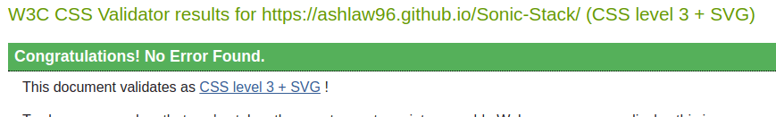
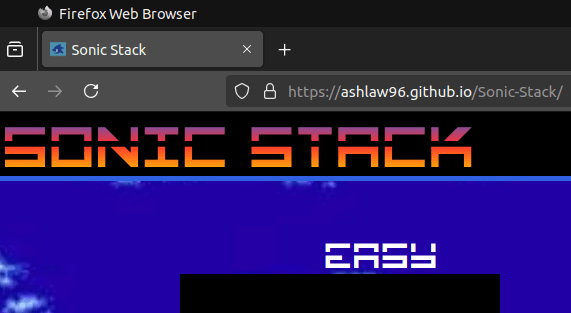
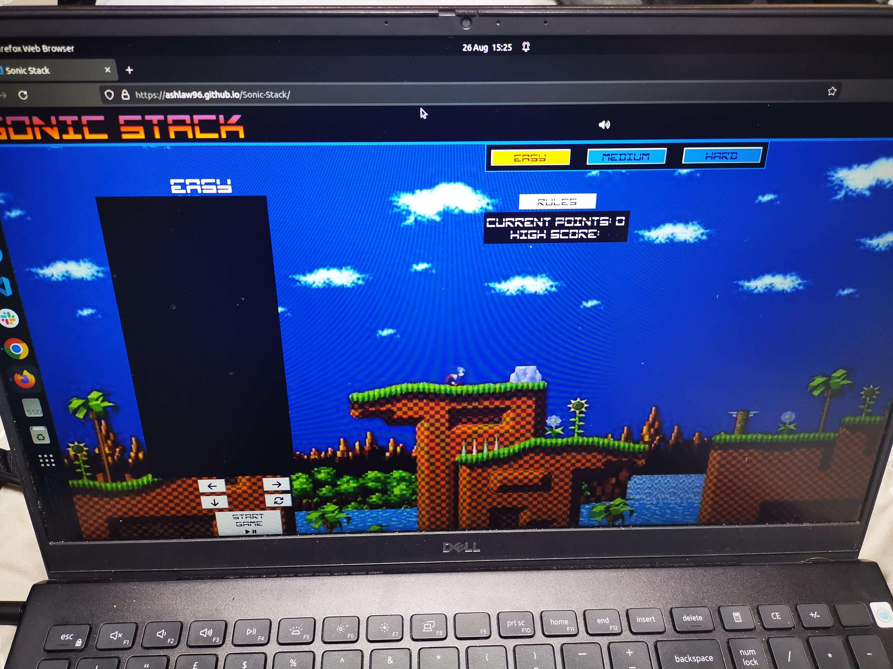
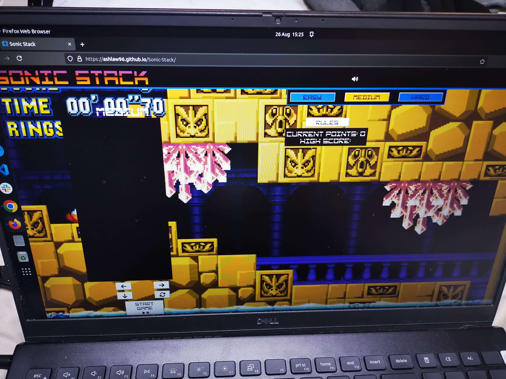
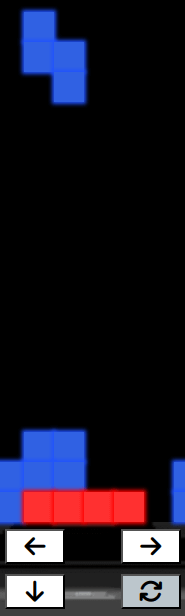
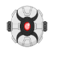

# Testing

> [!NOTE]  
> Return back to the [README.md](README.md) file.

Feature-by-Feature Testing:

- Navigation: I ensured smooth transitions between each section and the links directed to the correct destination.
- Responsive Design: I've checked for compatibility across multiple devices and screen sizes.
- Portfolio Display: I have verified that every page is properly showcased with accurate descriptions, images, and links.
- Game area: I confirmed that the game worked as intended on different devices and screen sizes.
- Buttons: I made sure that all buttons worked as they should and were easy to understand and read.
- Mute/Un-mute: I ensured that no audio would play unless the user clicked on the un-mute button.

User Experience Testing:

- Usability Testing: I let users interact with my site and provide feedback of their experience with it.

1. My first user was a late-20s woman who had played a lot of retro games. She stated how she enjoyed the Easy, Medium and Hard levels of the game and was a great way to progress which made her become more involved with the game. She also enjoyed the backgrounds and sound effects of the game which made it more enjoyable for her. She played this on her phone & explained how it was a great way to pass time in her commute to and from work. 
2. My next participant was a 60-year old man who had played the original Tetris game when he was younger but hadn't played in many decades. He spoke about how the game was somewhat nostalgic but gave a great sense of something different. He enjoyed how the different coloured blocks were a great touch to keep him focused and he enjoyed the fact he could use controls on the screen as he played on his very old & dated laptop where his buttons would occasionally stick. Therefore having buttons on the screen which he could use with a cursor meant he could play.
3. The last person I asked to test and review my game was a young boy who had recently got into playing modern games. He enjoyed the concept of this game and being of a younger generation, he knew of Sonic & liked that he could relate to that. He played in the car on his tablet with his Mum, who used to play the original Tetris game when she was younger. Together they both enjoyed the fact they could play together & made their own game out of trying to beat each other's high score. 

- Accessibility Testing: I confirmed compliance with accessibility standards e.g. screen reader compatibility, proper alt text for images and keyboard navigation.

Compatibility Testing:

- Browser Compatibility: I Tested on different browsers, to ensure compatible performance.
- Device Compatibility: I ensured functionality across numerous devices.
- Performance Testing:
  - Speed and Load Testing: I used PageSpeed Insights to check page load times and optimized where necessary.

  

  
 Click here to see speed tests of both pages 

    main

    

    404
    
    
    
    

  - Scalability Testing: I assessed how the site handled increased traffic and usage.

Regression Testing:

After implementing any fixes or updates I ensured that previous features and functionalities still worked as intended.

#### Documentation and Logs:

- whilst creating the blocks, I noticed that where the blocks appeared the box shadow stayed when they left the area.

  - The issue: [issue](documentation/bugs/box-shadow-issue.png)

- To fix this issue I needed to add code into the correct function that removed the box shadow style.

  - The fix: [fix](documentation/bugs/fix-shadow.png)

- Whilst creating the rules hide button, I noticed that it wouldn't show and hide the text as desired.

  - The issue: [issue](documentation/bugs/display-type-issue.png)

- To fix this I had to remove multiple `span` elements inside the button element.
  
  - The fix: [fix](documentation/bugs/display-type-fix.png)

- Whilst creating the blocks, I noticed that the blocks were not in the correct designed shapes.

  - The issue: [issue](documentation/bugs/misshaped.png)

- To fix the issue, I had to change the game areas width and height so each div would fit evenly in the game area.

  - The fix: [fix](documentation/bugs/fix-misshaped.png)

- When creating the game, I noticed that when moving the blocks all way left or right of the game area, it would overlap to the opposite side of the game area.

  - The issue: [issue](documentation/bugs/overlap-right.png)

- To fix this issue, I had to add a function that checked if the block had reached the edge of the game area and if so stop.

  - The fix: [fix](documentation/bugs/fix-overlap-right.png)

- When trying to select all the `div` inside the game area I came across a type error.

  - The issue: [issue](documentation/bugs/type-error.png)

- To fix this issue I used the `querySelectorAll` to get all the child elements inside the game area.

  - The fix: [fix](documentation/bugs/fix-type-error.png)

- Whilst testing the game, I noticed that when turning the blocks near the edge of the game area they would overlap to the other side of the game area.

  - The issue: [issue](documentation/bugs/turn-overlap-screen.png)

- To fix the issue, I had to add a function that implemented code when the block turned near the edge of the game area, move its location away so it didn't overlap the game area.

  - The fix: [fix](documentation/bugs/turn-overlap-fix.png)

- When checking if the alteration of using JavaScript to create the game area had any effect with the 404 page I noticed a type error.

  - The issue: [issue](documentation/bugs/type-error-404.png)

- To fix the issue I had to add an if statement inside the for loop to check if the HTML id name was on the current page and if so execute the desired code but if not do nothing.

  - The fix: [fix](documentation/bugs/type-error-404-fix.png)

- When clicking the reset button, I noticed when starting a new game and receiving my first points, my current score would automatically carry on from the previous games score.

  - The issue: [issue](documentation/bugs/score-reset-issue.png)

- To fix this I had to reset both my current score to 0 and my points variable to 0 to start the score count again.

  - The fix: [fix](documentation/bugs/score-reset-fix.png)

- After receiving points and the next block starts dropping some other squares also appear.

  - The issue: [issue](documentation/bugs/blocks-appear.png)

- To fix this I had to call the `gotPoints` function earlier in the `stop` function so it would action the code in the `gotPoints` function before any of the others.

  - The fix: [fix](documentation/bugs/blocks-appear-fix.png)

## Code Validation

### HTML

I have used the recommended [HTML W3C Validator](https://validator.w3.org) to validate all of my HTML files.

| Directory | File | Screenshot | Notes |
| --- | --- | --- | --- |
|  | index.html |  | no issues were found |
|  | 404.html |  | no issues were found |

### CSS

I have used the recommended [CSS Jigsaw Validator](https://jigsaw.w3.org/css-validator) to validate all of my CSS files.

| Directory | File | Screenshot | Notes |
| --- | --- | --- | --- |
| assets | styles.css |  | no issues were found |

## Browser Compatibility

Sample browser testing documentation:

I've tested my deployed project on multiple browsers to check for compatibility issues.

| Browser | Easy | Medium | Hard | 404 | Notes |
| --- | --- | --- | --- | --- | --- |
| Chrome |  |  |  |  | Works as expected |
| Firefox |  |  |  |  | Works as expected |
| Edge |  |  |  |  | Works as expected |
| Amazon Silk |  |  |  |  | Minor CSS differences |
| Bing |  |  |  |  | Works as expected |

## Responsiveness

Sample responsiveness testing documentation:

I've tested my deployed project on multiple devices to check for responsiveness issues.

| Device | Easy | Medium | Hard | 404 | Notes |
| --- | --- | --- | --- | --- | --- |
| Mobile |  |  |  |  | Works as expected |
| Tablet |  |  |  |  | Works as expected |
| Laptop |  |  |  |  | Works as expected |
| Desktop |  |  |  |  | Works as expected |
| XL screen |  |  |  |  | Noticeable scaling issues |

## Lighthouse Audit

Sample Lighthouse testing documentation:

I've tested my deployed project using the Lighthouse Audit tool to check for any major issues.

| Page | Mobile | Desktop | Notes |
| --- | --- | --- | --- |
| Main |  |  | Some warnings |
| 404 |  |  | Some warnings |

## Defensive Programming

Defensive programming was manually tested with the below user acceptance testing:

| Page | Expectation | Test | Result | Fix | Screenshot |
| --- | --- | --- | --- | --- | --- |
| Easy | | | | | |
| | When the navigation icon is clicked, (3 lines/burger symbol) should show navigation buttons and when clicked again should hide them | Tested the feature by clicking on the icon on a variety of devices and browsers to make sure it un-hides and hides the buttons | The feature behaved as expected and it showed the navigation buttons when first clicked the hid them when clicked again | Test concluded and passed |  |
| | When each navigation button is clicked on it should change the colour of the current mode that has been clicked on, should change the game difficulty, the title, the background image and the background theme audio | Tested the feature by pressing each button multiple times and multiple devices and browsers | The feature behaved as expected and changed what needed to change | Test concluded and passed |  |
| | When the header title is clicked on should navigate back to the main page | Tested the feature by clicking on the main header title on each section and page on a variety of devices and browsers | The feature behaved as expected and navigated back to the main home page | Test concluded and passed |  |
| | When the rules button is clicked on it should show hidden text and when clicked on again should hide the text | Tested this feature by clicking it on and off on different devices and browsers | This feature behaved as it was expected and showed the hidden text the hid the text when clicked again | Test concluded and passed |  |
| | When the play game button is first pressed, it should start the blocks dropping and if the un-mute button is clicked should also play the background audio. When the pause button is clicked again, it should stop the blocks dropping and pause the background audio | This feature was tested by clicking the button multiple times on different devices and browsers | The feature did what was expected by starting the game, then pausing and playing when clicked on again | Test concluded and passed |  |
| | When each button is pressed it should move the blocks in the correct direction that is shown on the buttons. The twist button will also make an audio noise when clicked if the un-mute button is clicked | This was tested by clicking all the buttons to make sure the blocks moved in the correct direction and that the spin button made a noise when clicked | The features did what expected except when the twist button is clicked quickly the audio doesn't play each time | Test concluded and passed because when the twist button is pressed slightly slower the sound worked as expected |  |
| | When the left, right, down and space keys are clicked it should move the blocks and also when the space key is clicked it should make the turning audio sound if the un-mute button is clicked. Also during the game the keys should not make the screen move | This was tested by pressing each key to make sure the blocks moved in the correct direction and that the space key made a noise when pressed and also that the screen only moved with the keys when the game was not playing | The features did what expected except, when the space key is pressed quickly the audio didn't play every time | Test concluded and passed because when the space key is pressed slightly slower the sound worked as expected |  |
| | When a full horizontal line of blocks are across the game area, it should add 100 to the score and remove the full line and also when the un-mute button is clicked it should make an audio sound | This was tested by adding full lines in different parts of the game area to make sure it worked everywhere | This feature did what expected and added points when should have, then removed the full line and made the audio sound when getting the points | Test concluded and passed |  |
| | When a part of the block reaches the top of the screen should stop the game and show a button saying they have lost, also if the un-mute button is clicked it should stop the background audio and play a different lost sound audio | Tested this feature by losing the game all across the top of the game area with each of the different shaped blocks | The feature did what was expected and showed the lost button, played the lost sound and paused the other background sound when it was supposed to | Test concluded and passed |  |
| | When a user loses the game a button appears in the center of the screen and the user should only be able to remove this by clicking the button or pressing the escape key | This was tested by losing the game on a multitude of devices and browser and trying both the escape key and clicking the button itself to remove the loss button | The feature did what it should and removed the loss button when either the escape key was pressed or the close button was clicked | Test concluded and passed |  |
| | When a user losses the game, if the current score is higher than the high score it should change the high score to this number if not it should stay the same | Tested by gaining different scores both higher and lower than the high score and making sure that it changed the high score when needed to | This feature did what was expected and changed the high score when the current score was higher and didn't change when it was lower | Test concluded and passed |  |
| | When the mute/un-mute button hasn't been clicked on no audio should happen, only when the user clicks the button should audio be enabled and the buttons background colour will be visible, then when clicked again the audio should stop and the background colour should not be visible | This was tested on a variety of browsers clicking it on and off many times | The feature did what was expected firstly un-muting the audio and changing it's background colour then muting it and changing the background colour when clicked again | Test concluded and passed |  |
| | When the user clicks the restart button it will remove all the blocks from the game area and set the score back to zero | This was tested by having the game both running and paused, then clicking on the reset button to make sure the correct things did what was required. This was also done on different browsers and devices | The feature did what it was supposed when clicked and removed all the blocks and set the score back to zero | Test concluded and passed |  |
| | When the links in the footer are clicked on it should open up a new tab and direct them to the specific website | This was tested on different browsers and devices to make sure new tabs opened for each link and the correct link opened in the new tab | The features did what they were supposed and all opened in new tabs and went to the correct website | Test concluded and passed |  | 
| Medium | | | | | |
| | When the navigation icon is clicked, (3 lines/burger symbol) should show navigation buttons and when clicked again should hide them | Tested the feature by clicking on the icon on a variety of devices and browsers to make sure it un-hides and hides the buttons | The feature behaved as expected and it showed the navigation buttons when first clicked the hid them when clicked again | Test concluded and passed |  |
| | When each navigation button is clicked on it should change the colour of the current mode that has been clicked on, should change the game difficulty, the title, the background image and the background theme audio | Tested the feature by pressing each button multiple times and multiple devices and browsers | The feature behaved as expected and changed what needed to change | Test concluded and passed |  |
| | When the header title is clicked on should navigate back to the main page | Tested the feature by clicking on the main header title on each section and page on a variety of devices and browsers | The feature behaved as expected and navigated back to the main home page | Test concluded and passed |  |
| | When the rules button is clicked on it should show hidden text and when clicked on again should hide the text | Tested this feature by clicking it on and off on different devices and browsers | This feature behaved as it was expected and showed the hidden text the hid the text when clicked again | Test concluded and passed |  |
| | When the play game button is first pressed, it should start the blocks dropping and if the un-mute button is clicked should also play the background audio. When the pause button is clicked again, it should stop the blocks dropping and pause the background audio | This feature was tested by clicking the button multiple times on different devices and browsers | The feature did what was expected by starting the game, then pausing and playing when clicked on again | Test concluded and passed |  |
| | When each button is pressed it should move the blocks in the correct direction that is shown on the buttons. The twist button will also make an audio noise when clicked if the un-mute button is clicked | This was tested by clicking all the buttons to make sure the blocks moved in the correct direction and that the spin button made a noise when clicked | The features did what expected except when the twist button is clicked quickly the audio doesn't play each time | Test concluded and passed because when the twist button is pressed slightly slower the sound worked as expected |  |
| | When the left, right, down and space keys are clicked it should move the blocks and also when the space key is clicked it should make the turning audio sound if the un-mute button is clicked. Also during the game the keys should not make the screen move | This was tested by pressing each key to make sure the blocks moved in the correct direction and that the space key made a noise when pressed and also that the screen only moved with the keys when the game was not playing | The features did what expected except, when the space key is pressed quickly the audio didn't play every time | Test concluded and passed because when the space key is pressed slightly slower the sound worked as expected |  |
| | When a full horizontal line of blocks are across the game area, it should add 100 to the score and remove the full line and also when the un-mute button is clicked it should make an audio sound | This was tested by adding full lines in different parts of the game area to make sure it worked everywhere | This feature did what expected and added points when should have, then removed the full line and made the audio sound when getting the points | Test concluded and passed |  |
| | When a part of the block reaches the top of the screen should stop the game and show a button saying they have lost, also if the un-mute button is clicked it should stop the background audio and play a different lost sound audio | Tested this feature by losing the game all across the top of the game area with each of the different shaped blocks | The feature did what was expected and showed the lost button, played the lost sound and paused the other background sound when it was supposed to | Test concluded and passed |  |
| | When a user loses the game a button appears in the center of the screen and the user should only be able to remove this by clicking the button or pressing the escape key | This was tested by losing the game on a multitude of devices and browser and trying both the escape key and clicking the button itself to remove the loss button | The feature did what it should and removed the loss button when either the escape key was pressed or the close button was clicked | Test concluded and passed |  |
| | When a user losses the game, if the current score is higher than the high score it should change the high score to this number if not it should stay the same | Tested by gaining different scores both higher and lower than the high score and making sure that it changed the high score when needed to | This feature did what was expected and changed the high score when the current score was higher and didn't change when it was lower | Test concluded and passed |  |
| | When the mute/un-mute button hasn't been clicked on no audio should happen, only when the user clicks the button should audio be enabled and the buttons background colour will be visible, then when clicked again the audio should stop and the background colour should not be visible | This was tested on a variety of browsers clicking it on and off many times | The feature did what was expected firstly un-muting the audio and changing it's background colour then muting it and changing the background colour when clicked again | Test concluded and passed |  |
| | When the user clicks the restart button it will remove all the blocks from the game area and set the score back to zero | This was tested by having the game both running and paused, then clicking on the reset button to make sure the correct things did what was required. This was also done on different browsers and devices | The feature did what it was supposed when clicked and removed all the blocks and set the score back to zero | Test concluded and passed |  |
| | When the links in the footer are clicked on it should open up a new tab and direct them to the specific website | This was tested on different browsers and devices to make sure new tabs opened for each link and the correct link opened in the new tab | The features did what they were supposed and all opened in new tabs and went to the correct website | Test concluded and passed |  | 
| Hard | | | | | |
| | When the navigation icon is clicked, (3 lines/burger symbol) should show navigation buttons and when clicked again should hide them | Tested the feature by clicking on the icon on a variety of devices and browsers to make sure it un-hides and hides the buttons | The feature behaved as expected and it showed the navigation buttons when first clicked the hid them when clicked again | Test concluded and passed |  |
| | When each navigation button is clicked on it should change the colour of the current mode that has been clicked on, should change the game difficulty, the title, the background image and the background theme audio | Tested the feature by pressing each button multiple times and multiple devices and browsers | The feature behaved as expected and changed what needed to change | Test concluded and passed |  |
| | When the header title is clicked on should navigate back to the main page | Tested the feature by clicking on the main header title on each section and page on a variety of devices and browsers | The feature behaved as expected and navigated back to the main home page | Test concluded and passed |  |
| | When the rules button is clicked on it should show hidden text and when clicked on again should hide the text | Tested this feature by clicking it on and off on different devices and browsers | This feature behaved as it was expected and showed the hidden text the hid the text when clicked again | Test concluded and passed |  |
| | When the play game button is first pressed, it should start the blocks dropping and if the un-mute button is clicked should also play the background audio. When the pause button is clicked again, it should stop the blocks dropping and pause the background audio | This feature was tested by clicking the button multiple times on different devices and browsers | The feature did what was expected by starting the game, then pausing and playing when clicked on again | Test concluded and passed |  |
| | When each button is pressed it should move the blocks in the correct direction that is shown on the buttons. The twist button will also make an audio noise when clicked if the un-mute button is clicked | This was tested by clicking all the buttons to make sure the blocks moved in the correct direction and that the spin button made a noise when clicked | The features did what expected except when the twist button is clicked quickly the audio doesn't play each time | Test concluded and passed because when the twist button is pressed slightly slower the sound worked as expected |  |
| | When the left, right, down and space keys are clicked it should move the blocks and also when the space key is clicked it should make the turning audio sound if the un-mute button is clicked. Also during the game the keys should not make the screen move | This was tested by pressing each key to make sure the blocks moved in the correct direction and that the space key made a noise when pressed and also that the screen only moved with the keys when the game was not playing | The features did what expected except, when the space key is pressed quickly the audio didn't play every time | Test concluded and passed because when the space key is pressed slightly slower the sound worked as expected |  |
| | When a full horizontal line of blocks are across the game area, it should add 100 to the score and remove the full line and also when the un-mute button is clicked it should make an audio sound | This was tested by adding full lines in different parts of the game area to make sure it worked everywhere | This feature did what expected and added points when should have, then removed the full line and made the audio sound when getting the points | Test concluded and passed |  |
| | When a part of the block reaches the top of the screen should stop the game and show a button saying they have lost, also if the un-mute button is clicked it should stop the background audio and play a different lost sound audio | Tested this feature by losing the game all across the top of the game area with each of the different shaped blocks | The feature did what was expected and showed the lost button, played the lost sound and paused the other background sound when it was supposed to | Test concluded and passed |  |
| | When a user loses the game a button appears in the center of the screen and the user should only be able to remove this by clicking the button or pressing the escape key | This was tested by losing the game on a multitude of devices and browser and trying both the escape key and clicking the button itself to remove the loss button | The feature did what it should and removed the loss button when either the escape key was pressed or the close button was clicked | Test concluded and passed |  |
| | When a user losses the game, if the current score is higher than the high score it should change the high score to this number if not it should stay the same | Tested by gaining different scores both higher and lower than the high score and making sure that it changed the high score when needed to | This feature did what was expected and changed the high score when the current score was higher and didn't change when it was lower | Test concluded and passed |  |
| | When the mute/un-mute button hasn't been clicked on no audio should happen, only when the user clicks the button should audio be enabled and the buttons background colour will be visible, then when clicked again the audio should stop and the background colour should not be visible | This was tested on a variety of browsers clicking it on and off many times | The feature did what was expected firstly un-muting the audio and changing it's background colour then muting it and changing the background colour when clicked again | Test concluded and passed |  |
| | When the user clicks the restart button it will remove all the blocks from the game area and set the score back to zero | This was tested by having the game both running and paused, then clicking on the reset button to make sure the correct things did what was required. This was also done on different browsers and devices | The feature did what it was supposed when clicked and removed all the blocks and set the score back to zero | Test concluded and passed |  |
| | When the links in the footer are clicked on it should open up a new tab and direct them to the specific website | This was tested on different browsers and devices to make sure new tabs opened for each link and the correct link opened in the new tab | The features did what they were supposed and all opened in new tabs and went to the correct website | Test concluded and passed |  | 
| 404 | | | | | |
| | When the navigation icon is clicked, (3 lines/burger symbol) should show navigation button | Tested the feature by clicking on a variety of devices and browsers | The feature behaved as expected and it showed the navigation buttons | Test concluded and passed |  |
| | When the header title is clicked on should navigate back to the main page | Tested the feature by clicking on the main header title on each section and page on a variety of devices and browsers | The feature behaved as expected and navigated back to the main home page | Test concluded and passed |  |
| | When the navigation run away button is clicked on it should navigate the user back to the main page | This was tested by clicking the button on a variety of devices and browsers | The feature should navigate the user back to the main site | Test concluded and passed |  |
| | When the mute/un-mute button hasn't been clicked on no audio should happen, only when the user clicks the button should audio be enabled and the buttons background colour will be visible, then when clicked again the audio should stop and the background colour should not be visible | This was tested on a variety of browsers clicking it on and off many times | The feature did what was expected firstly un-muting the audio and changing it's background colour then muting it and changing the background colour when clicked again | Test concluded and passed |  |
| | When the un-mute button is been clicked and then the user clicks the click me button it should play an audio sound | Tested this feature by clicking the button on different devices and browsers | The feature behaved as expected and played the audio when the button was clicked | Test concluded and passed |  |

## User Story Testing

| User Story | Screenshot |
| --- | --- |
| As a new site user, I would like to easily understand the instructions, so that I can play the game as soon as possible. |  |
| As a new site user, I would like to be able to choose different difficulties, so that I can have fun and challenge myself. |  |
| As a new site user, I would like to be able to see my score, so that I can see what I need to be better. |  |
| As a new site user, I would like to see what the high score is, so that I can try and beat it |  |
| As a new site user, I would like to be able to see others play, so that it can help me improve how I play |  | 
| --- | --- |
| As a returning site user, I would like to pause the game, so that I can come back to where I left off. |  |
| As a returning site user, I would like to hear old school Sonic music, so that it can feel like the old games when I'm playing. |  |
| As a returning site user, I would like to play multiplayer/split-screen, so that I can play with my friends. | (Need to add more CSS to add separate boxes in the main section and add JS to open and close it) |
| As a returning site user, I would like to have different levels, so that it feels like I've accomplished something | (Need to add CSS to style another section and JS to add a levels section that changes the game speed and amount of points gained when a user gets so many points) |
| As a returning site user, I would like to see a scoreboard, so that I can see all the different scores of other people and try to beat them | (Need to add JS to save users names and users high score to the `localStorage()` then use backend library to save scores and add both the name and score to a table)
| --- | --- |
| As a site administrator, I should be able to check how much traffic my site is getting, so that I can try to improve and gain more if needed. |  |
| As a site administrator, I should be able to see how many people play each level, so that I can add more levels if needed. |  |
| As a site administrator, I should be able to see the load speed of the site, so that I can improve where needed. |  |

## Bugs

- Style error: box shadow remains when blocks move

  Issue

  

  Fix

  

- JS Uncaught TypeError: cannot read properties of undefined (reading `display`)

  Issue

  

  Fix

  

- Style error: the blocks are incorrectly shaped 

  Issue

  

  Fix

  

- Style error: the blocks move into the opposite side of the game area

  Issue

  

  Fix

  

- Style error: when turning the blocks move into the opposite side of the game area

  Issue

  

  Fix

  

- JS Uncaught TypeError: cannot read properties of null (reading `appendChild`)

  Issue

  

  Fix

  

- JS Uncaught TypeError: cannot read properties of undefined (reading `classList`)

  Issue

  

  Fix

  

- Inner text error: When restart game score added previous score when gaining first points

  Issue

  

  Fix

  

- Style error: after getting points when the next block started dropping, squares would appear inside the game area

  Issue

  

  Fix

  

- To see more information about the bugs and fixes, see here - [The Bugs/Fixes:](#documentation-and-logs)

> [!NOTE]  
> There are no remaining bugs that I am aware of.
